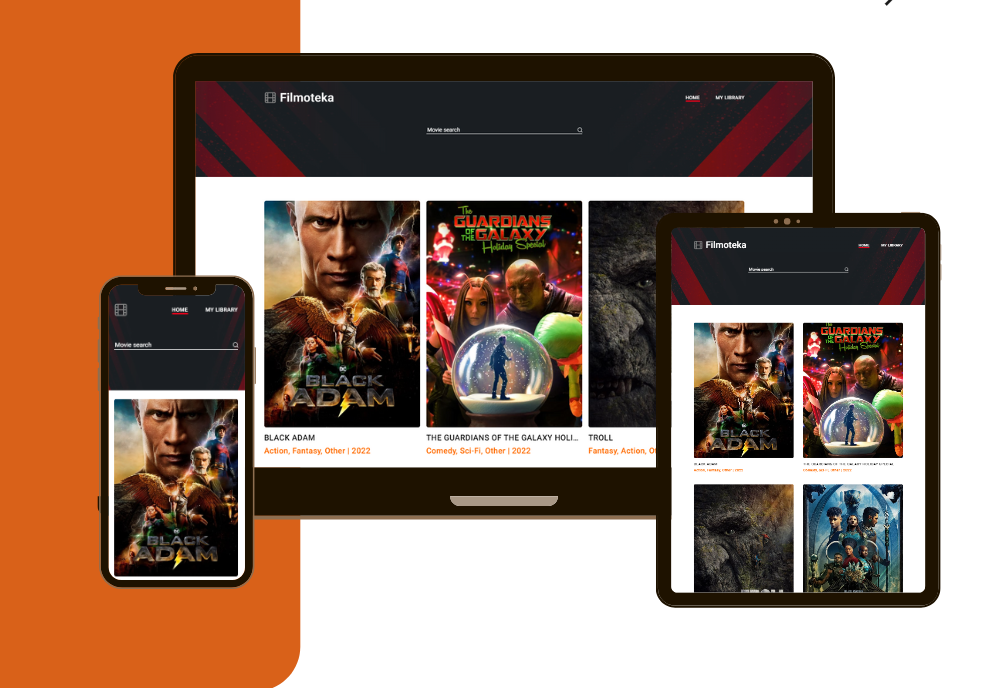

# This is the graduation project of JavaScript course, GоIT academy - Filmoteka.

Our team is "JS Mastermind" and we are proud of our project. We tried to do our
best during 5 working days and you can see the result for clicking to link
below:

[View a project link.](https://veronikanos.github.io/FilmotekaTeamProject)

## This project was created by:

- Team Lead: [Veronika Tlostiuk]()
- Scrum master & Front-end developer:
  [Arsenii Maksymenko](https://github.com/smerch88)
- Front-end developer: [Petro Kryvyak](https://github.com/Petro199)
- Front-end developer: [Inna Forkert](https://github.com/InnaForkert)
- Front-end developer: [Oleksii Turchynyk](https://github.com/TurchynykOleksii)

---

We prepared adaptive web page for three screen types with following breakpoints:
mobile - 320px, tablet - 768px, desktop - 1280px according to Figma layout, that
we got as a part of task.

---

### We dealt with such tasks :

- develop a web-api for searching films by keyword;
- show popular films at the main page;
- organize user's library for collecting favorite and watched films;
- organize for user's library an opportunity to delete movie from library;
- create a movie card like modal window with movie's detailed description;
- show movie trailers at the user's request;
- implement pagination (tui-pagination);
- implement custom cursor and scroll;
- prune long titles under each card, so every row was the same height for better
  visual.

  ***

### We used such technologies:

- HTML and CSS/SASS;
- JavaScript;
- API/HTTP Requests;
- Axios/Notify/Tui-pagination,
- Parcel;
- Git/Github;
- Trello/Scrum methodology

---

## Product's presentation photo

---

### HOW TO RUN THIS PROJECT LOCALLY

This project was created with Parcel. For familiarization and setting additional
features [refer to documentation](https://parceljs.org/).

Clone this repo:
`git clone https://github.com/Veronikanos/FilmotekaTeamProject.git`

In the project directory, you can run:

#### `npm install`

then

#### `npm start`

Runs the app in the development mode.\
Open [http://localhost:1234](http://localhost:1234) to view it in your browser.

The page will reload when you make changes.\
You may also see any lint errors in the console.
